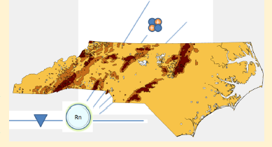
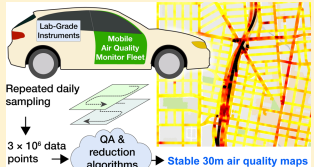
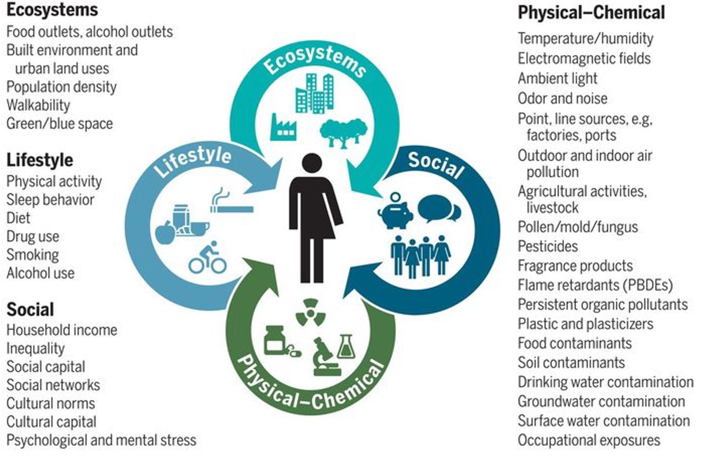
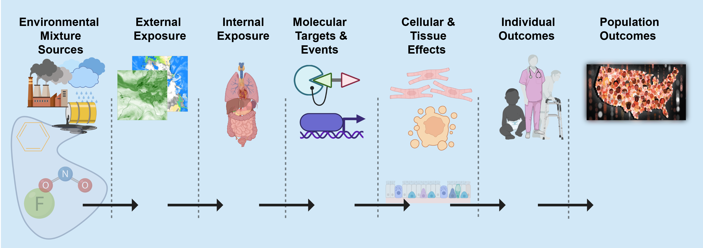
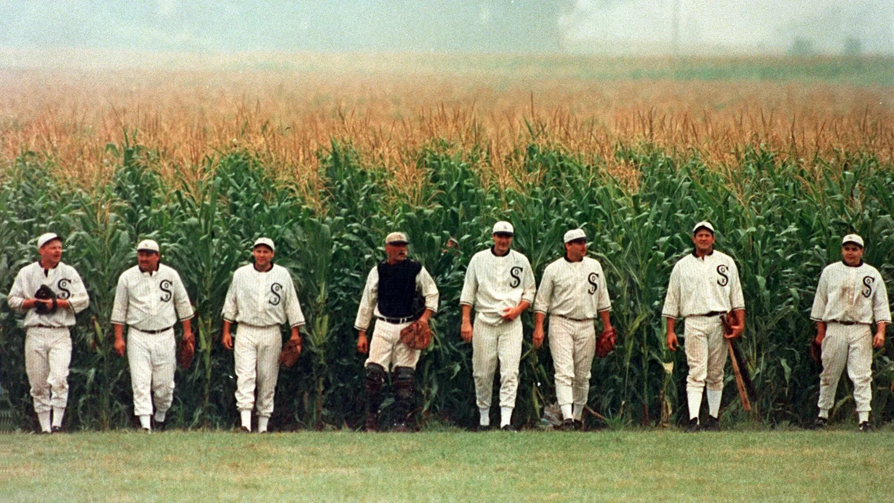
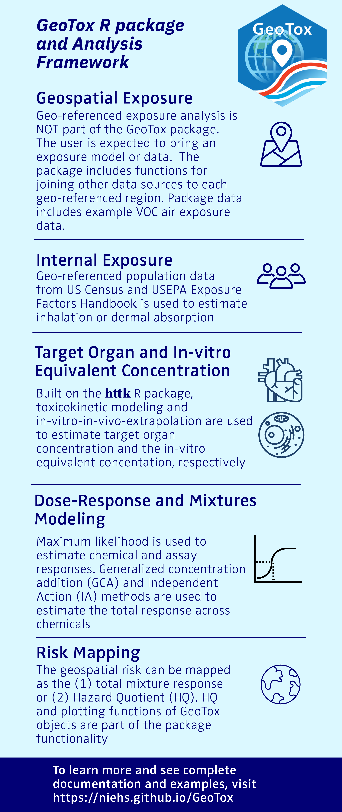
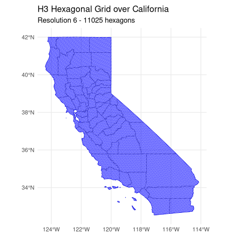
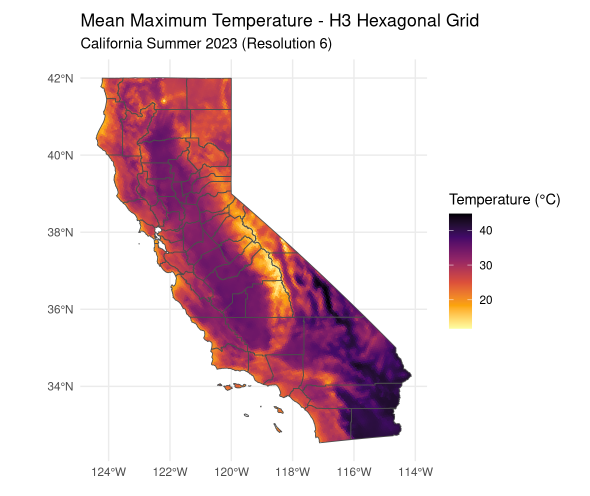

# Background {.section-title background-color="#3d763d"}

<!-------------------------------------------------------------------------->
<!--------------------------------------------------------------------------->
## Career Overview

::: {.columns}
::: {.column width="55%"}
**A path through geostatistics, exposure science, and open-source tools**

- 🎓 **PhD** — UNC Chapel Hill, Environmental Sciences & Engineering
- 🧪 **Postdoc** — Environmental Defense Fund
- 🏔️ **Research Faculty** — Oregon State University (K99/R00)
- 🏛️ **NIEHS** — Stadtman Tenure-Track Investigator

:::
::: {.column width="45%"}

::: {.r-stack}
::: {style="text-align:center;"}
{width=220}


↓

{width=220}


↓

{width=220}


↓

{width=220}
:::
:::

:::
:::

::: {.notes}
Introduce the narrative arc: each career stage added a new tool or method that feeds into the current research program — ultimately a source-to-outcome story.
:::

<!-------------------------------------------------------------------------->
<!--------------------------------------------------------------------------->
## UNC Chapel Hill — PhD

::: {.columns}
::: {.column width="65%"}
**Department of Environmental Sciences & Engineering**

- Focus: **geostatistics** and spatiotemporal exposure modeling via Bayesian Maximum Entropy (BME)
- Advisor: Dr. Marc Serre
- Developed scalable methods for large geospatial datasets
- Key insight: land-use regression (LUR) plus Kriging/BME improves space/time prediction over LUR or Kriging alone in most environmental exposure settings

:::
::: {.column width="35%"}
{width=420}
:::
:::

<!-------------------------------------------------------------------------->
<!--------------------------------------------------------------------------->
## Postdoc — Environmental Defense Fund

::: {.columns}
::: {.column width="60%"}
**Mobile Monitoring & Urban Air Quality Mapping**

- **Environmental Defense Fund** 
- Deployed mobile monitoring platforms to measure near-road air quality at high spatial resolution
- Mapped intra-urban variability in NO, NO₂, black carbon
- Demonstrated that fixed-site monitors miss substantial intra-urban gradients
- Contributed to Google Street View–EDF collaborative campaigns
:::
::: {.column width="40%"}
{width=420}
:::
:::

<!-------------------------------------------------------------------------->
<!--------------------------------------------------------------------------->
## Oregon State University — K99/R00


**NIH K99/R00 Pathway to Independence Award**

- Built independent research program bridging **geostatistics** and **multivariate exposomic data**
- Developed appreciation for primary data collection(e.g. analytical chemistry)
- Focus on indoor and outdoor exposures from air pollution
- Focus: scalable methods applicable to national-scale, multi-year exposure assessment

- Collaboration with spatial statistician **Matthias Katzfuss** → General Vecchia approximation for GP scalability
> *Messier ... K.A. Anderson (2019). Indoor versus Outdoor Air Quality during Wildfires. ES&T Letters*
> *Messier & Katzfuss (2021). Scalable penalized spatiotemporal land-use regression for ground-level nitrogen dioxide. Annals of Applied Statistics*


<!-------------------------------------------------------------------------->
<!--------------------------------------------------------------------------->
## NIEHS — Stadtman Tenure-Track Investigator

::: {.columns}
::: {.column width="60%"}
**Spatiotemporal Exposures and Toxicology (SET) Group**

- **Division of Translational Toxicology** — Predictive Toxicology Branch
- **Biostatistics and Computational Biology Branch**
- Part of the NIH **Stadtman Investigator** program
- Research focus:
  - Scalable spatiotemporal exposure models for exposomics
  - Open-source software for environmental health community (exposure, modeling, toxicology, and epidemiology)
   - Open-source software for spatial analysis 
  - Source-to-outcome risk modeling (
  - CHORDS: Connecting Health Outcomes Research Data Systems
:::
::: {.column width="40%"}
{width=420}
:::
:::

<!-------------------------------------------------------------------------->
<!--------------------------------------------------------------------------->
## Exposomics 

{fig-align="center" width="90%"}

<!-------------------------------------------------------------------------->
<!--------------------------------------------------------------------------->

# The Exposome Cascade: Source-to-Outcome Framework {.section-title background-color="#3d763d"}

<!-------------------------------------------------------------------------->
<!--------------------------------------------------------------------------->

## Source-to-Outcome Framework

{fig-align="center" height="320"}

::: {style="display: flex; align-items: center; justify-content: center; margin-top: 30px;"}
::: {style="background-color: #f8f9fa; border: 2px solid #3d763d; border-radius: 15px; padding: 25px; text-align: center; max-width: 85%; box-shadow: 0 4px 6px rgba(0,0,0,0.1);"}
**A Cascade of Events: The Events MUST Occur In This Order**
:::
:::

<!-------------------------------------------------------------------------->
<!--------------------------------------------------------------------------->

## Source-to-Outcome Framework

::: {style="display: flex; align-items: center; justify-content: center; min-height: 500px;"}
::: {style="background-color: #f8f9fa; border: 2px solid #3d763d; border-radius: 15px; padding: 25px; text-align: center; max-width: 85%; box-shadow: 0 4px 6px rgba(0,0,0,0.1);"}
**A general, extensible framework for modeling exposomic risk from the exogenous source through biological mechanism to health outcomes**
:::
:::

<!-------------------------------------------------------------------------->
<!--------------------------------------------------------------------------->

## Research Vision: Source-to-Outcome Framework

::: {style="text-align: center; margin-top: 10px;"}
{fig-align="center" height="240"}
:::

::: {style="display: flex; align-items: center; justify-content: center; margin-top: 20px;"}
::: {style="background-color: #f8f9fa; border: 2px solid #3d763d; border-radius: 15px; padding: 20px; text-align: center; max-width: 85%; box-shadow: 0 4px 6px rgba(0,0,0,0.1); font-size: 0.85em;"}
**The central objective:** Developing a framework based on rigorous methods and open source, accessible software that can integrate the diverse data sources in environmental health to model the expsomic risk from the exogenous source through biological mechanisms to health outcomes.
:::
:::

<!-------------------------------------------------------------------------->
<!--------------------------------------------------------------------------->

## Source-to-Outcome: GeoTox Software

{fig-align="center" height="480"}

::: {style="display: flex; gap: 15px; margin: 20px auto; max-width: 95%; justify-content: center;"}

::: {style="background-color: #f8f9fa; border: 2px solid #518611; border-radius: 10px; padding: 6px; flex: 1; font-size: 7pt;"}
Eccles, K. M., Karmaus, A. L., Kleinstreuer, N. C., Parham, F., Rider, C. V., Wambaugh, J. F., & Messier, K. P. (2023). A geospatial modeling approach to quantifying the risk of exposure to environmental chemical mixtures via a common molecular target. *Science of The Total Environment*, 855, 158905.
:::

::: {style="background-color: #f8f9fa; border: 2px solid #518611; border-radius: 10px; padding: 6px; flex: 1; font-size: 7pt;"}
Messier, K. P., Reif, D. M., & Marvel, S. W. (2025). The GeoTox Package: open-source software for connecting spatiotemporal exposure to individual and population-level risk. *Human Genomics*.
:::

:::

<!-------------------------------------------------------------------------->
<!--------------------------------------------------------------------------->

## An extensible, flexible modeling framework

::: {style="text-align: center; margin: 40px auto; max-width: 60%; font-size: 1.1em; line-height: 2.2;"}

**External Sources**  
↓  
*Geospatial Modeling*  
↓  
**External Exposure**  
↓  
*Behavioral and Physiological Modeling*  
↓  
**Internal Exposure**  
↓  
*PBTK*  
↓  
**Target Organ Dose**  
↓  
*IVIVE*  
↓  
**In vitro Equivalent Concentration**  
↓  
*Mixtures Modeling*  
↓  
**Concentration Response**  
↓  
*Risk Assessment*  
↓  
**Geospatial Risk Map**

:::

<!-------------------------------------------------------------------------->
<!--------------------------------------------------------------------------->

## GeoTox: Exposure Modeling {.smaller}

::: {.columns}
::: {.column width="50%"}
::: {style="text-align: center; margin: 20px auto; font-size: 1em; line-height: 2.2;"}

**External Sources**  
↓  
*Geospatial Modeling*  
↓  
**External Exposure**  
↓  
*Behavioral and Physiological Modeling*  
↓  
**Internal Exposure**

:::
:::
::: {.column width="50%"}

**Exposure Assessment Components:**

- **External Sources** — Environmental monitoring data, emissions inventories
- **Geospatial Modeling** — Spatial interpolation, predictive models
- **Behavioral/Physiological** — Activity patterns, inhalation rates, dermal contact

**Flexibility:** Plug in any exposure model (LUR, machine learning, dispersion models)

:::
:::

<!-------------------------------------------------------------------------->
<!--------------------------------------------------------------------------->

## GeoTox: Toxicokinetic & Dose-Response {.smaller}

::: {.columns}
::: {.column width="50%"}
::: {style="text-align: center; margin: 20px auto; font-size: 1em; line-height: 2.2;"}

**Internal Exposure**  
↓  
*PBTK*  
↓  
**Target Organ Dose**  
↓  
*IVIVE*  
↓  
**In vitro Equivalent Concentration**  
↓  
*Mixtures Modeling*  
↓  
**Concentration Response**

:::
:::
::: {.column width="50%"}

**Toxicology Components:**

- **PBTK** — Physiologically-based toxicokinetic models (HTTK)
- **IVIVE** — In vitro to in vivo extrapolation
- **Mixtures Modeling** — RGCA for multi-chemical interactions

**Flexibility:** Swap in alternative TK models, different dose-response functions

:::
:::

<!-------------------------------------------------------------------------->
<!--------------------------------------------------------------------------->

## GeoTox: Risk Assessment {.smaller}

::: {.columns}
::: {.column width="50%"}
::: {style="text-align: center; margin: 20px auto; font-size: 1em; line-height: 2.2;"}

**Concentration Response**  
↓  
*Risk Assessment*  
↓  
**Geospatial Risk Map**

:::
:::
::: {.column width="50%"}

**Risk Characterization:**

- **Population-level risk** — Monte Carlo simulation across demographics
- **Geospatial mapping** — County, ZCTA, grid-level risk surfaces
- **Uncertainty quantification** — Propagate variability through entire cascade

**Output:** Spatially-resolved risk estimates ready for public health decision-making

:::
:::

<!-------------------------------------------------------------------------->
<!--------------------------------------------------------------------------->


## An extensible, flexible modeling framework

::: {style="display: flex; align-items: center; justify-content: center; min-height: 500px;"}
::: {style="background-color: #f8f9fa; border: 2px solid #3d763d; border-radius: 15px; padding: 20px; text-align: center; max-width: 85%; box-shadow: 0 4px 6px rgba(0,0,0,0.1); font-size: 0.85em;"}
**Other Environmental Risk Assessment Frameworks as Special Cases of Source-to-Outcome Modeling** 
:::
:::

<!-------------------------------------------------------------------------->
<!--------------------------------------------------------------------------->

## Classic Spatial Epidemiology

::: {style="text-align: center; margin: 40px auto; max-width: 60%; font-size: 1.1em; line-height: 2.2;"}

**External Sources**  
↓  
*Geospatial Modeling*  
↓  
**External Exposure**  
↓  
*Exposure-Response Modeling*  
↓  
**Concentration Response**  
↓  
*Risk Assessment*  
↓  
**Geospatial Risk Map**

:::
<!-------------------------------------------------------------------------->
<!--------------------------------------------------------------------------->

## Spatial Epidemiology with Behavioral Exposure

::: {style="text-align: center; margin: 40px auto; max-width: 60%; font-size: 1.1em; line-height: 2.2;"}


**External Sources**  
↓  
*Geospatial Modeling*  
↓  
**External Exposure**  
↓  
*Behavioral and Physiological Modeling*  
↓  
**Internal Exposure**  
↓  
*Exposure-Response Modeling*  
↓  
**Concentration Response**  
↓  
*Risk Assessment*  
↓  
**Geospatial Risk Map**

:::

<!-------------------------------------------------------------------------->
<!--------------------------------------------------------------------------->

## Molecular Epidemiology

::: {style="text-align: center; margin: 40px auto; max-width: 60%; font-size: 1.1em; line-height: 2.2;"}


**Target Organ Dose (Measured)**  
↓  
*Concentration Response Modeling*  
↓  
**Concentration Response**  
↓  
*Risk Assessment*  


:::

<!-------------------------------------------------------------------------->
<!--------------------------------------------------------------------------->

## Spatial Epidemiology with Mechanistic Modeling

::: {style="display: flex; justify-content: center; margin-top: 20px; margin-bottom: 30px;"}
::: {style="background-color: #f8f9fa; border: 2px solid #3d763d; border-radius: 15px; padding: 25px; text-align: center; max-width: 85%; box-shadow: 0 4px 6px rgba(0,0,0,0.1);"}
**Assume individuals have measured biomarkers or biological data (e.g. epigenetic, transcriptomic, proteomic)**
:::
:::

::: {style="text-align: center; margin: 40px auto; max-width: 60%; font-size: 1.1em; line-height: 2.2;"}

**External Sources**  
↓  
*Geospatial Modeling*  
↓  
**External Exposure**  
↓  
*Mechanistic Modeling*  
↓  
**Mechanism Endpoint**  
↓  
*Concentration Response Modeling*  
↓  
**Concentration Response**  
↓  
*Risk Assessment*  

:::

::: {style="display: flex; justify-content: center; margin-top: 30px;"}
::: {style="background-color: #f8f9fa; border: 2px solid #3d763d; border-radius: 15px; padding: 25px; text-align: center; max-width: 85%; box-shadow: 0 4px 6px rgba(0,0,0,0.1);"}
**Relates External Exposure to Individual Mechanism Endpoints**
:::
:::

<!-------------------------------------------------------------------------->
<!--------------------------------------------------------------------------->

# Developing Accessible Geospatial Methods and Data {.section-title background-color="#3d763d"}

<!-------------------------------------------------------------------------->
<!--------------------------------------------------------------------------->
## Why Accessible Methods and Data?

1) Source-to-Outcome Modeling is clearly a complex problem.
2) There are many data sources, methods, and software to address each step in source-to-outcome modeling 
3) Documented and Open-Source tools and pipelines are needed to ensure teams can build upon each other
4) Accessible methods and data enable reproducible and scalable research

<!-------------------------------------------------------------------------->
<!--------------------------------------------------------------------------->

## FAIR Data and Software

**FAIR+ Principles:**

- **F**indable — published on CRAN, rOpenSci, and GitHub
- **A**ccessible — open-source, free, installable in one line
- **I**nteroperable — consistent APIs across packages; works with `{sf}`, `{terra}`, `{tidymodels}`
- **R**eusable — documented, versioned, tested, containerized
- **+Reproducible** — `{targets}` pipelines, Apptainer containers, HPC-ready


<!-------------------------------------------------------------------------->
<!--------------------------------------------------------------------------->


## Our Packages: Accessible Tools Across the Exposure Pipeline

::: {.columns}
::: {.column width="33%"}
{width=130 fig-alt="amadeus hex logo"}
**amadeus**  
Geospatial data access  
`CRAN · github.com/NIEHS/amadeus`

{width=130 fig-alt="chopin hex logo"}
**chopin**  
Parallel spatial computation  
`CRAN · rOpenSci`
:::
::: {.column width="33%"}
{width=130 fig-alt="beethoven hex logo"}
**beethoven**  
Ensemble air quality pipeline  
`github.com/NIEHS/beethoven`

{width=130 fig-alt="GeoTox hex logo"}
**GeoTox**  
Source-to-outcome risk modeling  
`CRAN · github.com/NIEHS/GeoTox`
:::
::: {.column width="33%"}
{width=130 fig-alt="PrestoGP logo"}
**PrestoGP**  
Scalable spatiotemporal GP regression  
`github.com/NIEHS/PrestoGP`

{width=130 fig-alt="RGCA hex logo"}
**RGCA**  
Chemical mixture dose-response  
`github.com/NIEHS/RGCA`
:::
:::

<br>

**Detailed Package Information:**

| # | Package | Description | Status |
|---|---------|-------------|--------|
| 1 | [**amadeus**](https://niehs.github.io/amadeus/) | Data access & processing for 17+ env. datasets | Active, CRAN |
| 2 | [**beethoven**](https://niehs.github.io/beethoven/) | Ensemble air quality model pipeline | WIP |
| 3 | [**chopin**](https://docs.ropensci.org/chopin/) | Parallel spatial computation | Active, CRAN, rOpenSci |
| 4 | [**GeoTox**](https://niehs.github.io/GeoTox) | Source-to-outcome risk modeling framework | Active, CRAN |
| 5 | [**RGCA**](https://niehs.github.io/RGCA) | Reflected GCA for chemical mixture dose-response | Active, GitHub |
| 6 | [**PrestoGP**](https://niehs.github.io/PrestoGP/) | Scalable penalized spatiotemporal GP regression | WIP |


---

# Building the Steps {.section-title background-color="#3d763d"}

1) Amadeus 
2) PrestoGP 
3) Beethoven 
4) GeoTox 

# Amadeus: Democratizing Geospatial Data Usage {.section-title background-color="#3d763d"}


<!-------------------------------------------------------------------------->
<!--------------------------------------------------------------------------->

## Motivation: Barriers to Geospatial Data

::: {.columns}
::: {.column width="55%"}
**The problem:**

- Environmental health research requires dozens of heterogeneous data sources
- Each source: unique file formats, APIs, naming conventions, coordinate systems
- Researchers spend enormous time on data wrangling before any analysis
- Results are often not reproducible across teams or HPC systems
- Smaller research groups lack resources to build custom pipelines
:::
::: {.column width="45%"}
**The goal:**

> Lower the barrier so that *any* researcher can access and process large-scale environmental data in R with a consistent API.

**CHORDS Program (NIEHS)**

> *Connecting Health Outcomes Research Data Systems* — building data infrastructure for patient-centered outcomes research on environment and health.
:::
:::

<!-------------------------------------------------------------------------->
<!--------------------------------------------------------------------------->
## amadeus: Overview

::: {.columns}
::: {.column width="60%"}
**A** **Ma**chine for **D**ata, **E**nvironments, and **U**ser **S**etup

- R package on **CRAN**: `install.packages("amadeus")`
- **17+ environmental data sources** under one consistent API
- Three-function workflow:
  1. `download_data()` — fetch raw data from source repositories
  2. `process_covariates()` — import, clean, standardize CRS + layer names
  3. `calculate_covariates()` — extract values at point locations (with optional buffer)
- Returns `data.frame`, `sf`, or `SpatVector` ready for modeling
:::
::: {.column width="40%"}
{width=220 fig-alt="amadeus hex logo"}
:::
:::

<!-------------------------------------------------------------------------->
<!--------------------------------------------------------------------------->
## amadeus: Data Sources

| Source | File Type | Genre | Extent |
|--------|-----------|-------|--------|
| EPA AQS | CSV | Air Pollution | US |
| MODIS (NASA) | HDF | Atmosphere / Land Use | Global |
| MERRA-2 (NASA) | netCDF | Meteorology | Global |
| NARR (NOAA) | netCDF | Meteorology | N. America |
| GridMet / TerraClimate | netCDF | Climate | US / Global |
| NLCD (MRLC) | GeoTIFF | Land Use | US |
| NOAA HMS Fire & Smoke | Shapefile | Wildfire Smoke | N. America |
| GMTED2010 (USGS) | Grid | Elevation | Global |
| Population Density (NASA SEDAC) | GeoTIFF | Demography | Global |
| EPA NEI / TRI | CSV | Emissions | US |
| EPA Ecoregions | Shapefile | Climate Regions | N. America |
| Köppen-Geiger Classification | GeoTIFF | Climate Classification | Global |
| NASA GEOS-CF | netCDF | Atmosphere | Global |

**Many more datasets are being added**
*Cropland, MODIS/VIIRS Fire, EDGAR Emissions, Drought* 

<!-------------------------------------------------------------------------->
<!--------------------------------------------------------------------------->
## amadeus: Workflow in Practice

::: {.panel-tabset}

## Workflow Code

```{r gridmet-tmmx-workflow, echo=TRUE, eval=FALSE}
#| code-line-numbers: "|3-11|13-17|19-29"

# Step 2: Download and process maximum temperature (tmmx)
download_data(
  dataset_name = "gridmet",
  variable = "tmmx",
  year = 2023,
  directory_to_save = data_dir
)

# Process tmmx to SpatRaster for summer months
tmmx_processed <- process_covariates(
  covariate = "gridmet",
  variable = "tmmx",
  date = c("2023-06-01", "2023-08-31"),
  path = file.path(data_dir, "tmmx")
)

# Step 6: Create H3 hexagonal grid and extract tmmx values
h3_grid_ca <- polygon_to_cells(ca_counties_sf, res = 6, simple = FALSE)

# Extract tmmx using H3 hexagon polygons (zonal statistics)
tmmx_h3 <- calculate_gridmet(
  from = tmmx_processed,
  locs = h3_grid_ca,
  locs_id = "h3_address",
  radius = 0,
  fun = "mean",
  geom = FALSE
)
```

**Note, updates are currently in process to allow more flexible space-time summarization with the calculate_* functions.**

## Process tmmx

**Process gridMET tmmx to SpatRaster for summer 2023**

```
class       : SpatRaster 
size        : 585, 1386, 92  (nrow, ncol, nlyr)
resolution  : 0.04166667, 0.04166667  (x, y)
extent      : -124.7875, -67.0375, 25.04583, 49.42083  (xmin, xmax, ymin, ymax)
coord. ref. : lon/lat WGS 84 (EPSG:4326) 
source      : tmmx_2023.nc 
varname     : tmmx (maximum near-surface air temperature) 
names       : tmmx_~30601, tmmx_~30602, tmmx_~30603, tmmx_~30604, tmmx_~30605, tmmx_~30606, ... 
unit        : K 
depth       : 45076 to 45167 (day [days since 1900-01-01 00:00:00]: 92 steps) 
time (days) : 2023-06-01 to 2023-08-31 (92 steps) 
```

- **92 daily layers** of maximum near-surface air temperature in Kelvin
- Covers CONUS at ~4km resolution (0.0417° grid cells)
- Summer 2023: June 1 – August 31

## California H3 Grid

{fig-align="center" width="45%"}

**H3 Resolution 6 hexagons** (~36 km² each) covering California

- Uniform spatial sampling with equal-area cells
- 6 equidistant neighbors per hexagon
- Hierarchical indexing system for efficient spatial queries

## H3 Hexagon Extraction

{fig-align="center" width="45%"}

**Extract tmmx values using H3 hexagonal grid**

- **Zonal statistics**: Mean temperature calculated across all grid cells within each hexagon
- Reveals spatial patterns missed by irregular administrative boundaries
- Summer 2023 mean maximum temperature (°C) across California

:::

<!-------------------------------------------------------------------------->
<!--------------------------------------------------------------------------->
## amadeus: Publication & Impact

::: {.columns}
::: {.column width="60%"}
**Peer-reviewed publication:**

> Manware, M., Song, I., Marques, E. S., Kassien, M. A., Clark, L. P., & Messier, K. P. (2025). Amadeus: Accessing and analyzing large scale environmental data in R. *Environmental Modelling & Software*, 186, 106352.

- On CRAN — installable by any R user worldwide
- Data backbone for **beethoven** air quality pipeline
- Vignette for every data source
- Active development — new sources added regularly
:::
::: {.column width="40%"}
*8,000+ downloads on CRAN*

`github.com/NIEHS/amadeus`
:::
:::

# Geospatial External Exposure Models {.section-title background-color="#3d763d"}

## Predicting geospatial external exposure 

1. Land-Use Regression 
2. Kriging / Gaussian Processes / BME 
3. Machine Learning methods - e.g. Random Forest, Gradient Boosting, Neural Nets, Ensembles

# PrestoGP: Scalable Spatiotemporal GP {.section-title background-color="#3d763d"}

::: {.columns}
::: {.column width="60%"}
**General Vecchia approximation** *(Katzfuss & Guinness 2021)*

$$p(\mathbf{y}) \approx \prod_{i=1}^n p(y_i \mid y_{c(i)})$$

Reduces computation: $\mathcal{O}(n^3)$ → $\mathcal{O}(nm^3)$, $m \ll n$

**PrestoGP model** *(Messier & Katzfuss 2020, JRSS-A)*

$$\mathbf{y} = \mathbf{X}\boldsymbol{\beta} + \mathbf{w} + \boldsymbol{\epsilon}$$

- $\mathbf{w}$: spatiotemporal GP with Matérn covariance
- $\boldsymbol{\beta}$: estimated via penalized likelihood (LASSO/SCAD/MCP)
- Variable selection + GP estimation *simultaneously*
:::
::: {.column width="40%"}
*[Vecchia neighbor diagram — placeholder]*
:::
:::

<!-------------------------------------------------------------------------->
<!--------------------------------------------------------------------------->
## PrestoGP: R Package API

```r
# Univariate spatiotemporal model
model <- new("VecchiaModel", n_neighbors = 10)
model <- prestogp_fit(model, y, X, locs)
yhat  <- prestogp_predict(model, X_new, locs_new)

# Multivariate (multiple pollutants simultaneously)
model_mv <- new("MultivariateVecchiaModel", n_neighbors = 10)
model_mv <- prestogp_fit(model_mv,
                         y    = list(y_no2, y_pm25),
                         X    = list(X_no2, X_pm25),
                         locs = list(locs, locs))

# LOD-censored imputation
model <- prestogp_fit(model, y_censored, X, locs,
                      impute.y = TRUE, lod = lod_value)
```

`github.com/NIEHS/PrestoGP`

<!-------------------------------------------------------------------------->
<!--------------------------------------------------------------------------->
## PrestoGP: Applications

::: {.columns}
::: {.column width="50%"}
**NO₂ Mapping** *(Messier & Katzfuss 2020)*

- Continental US ground-level NO₂
- Penalized LUR + spatiotemporal GP
- Better CV performance vs. standard LUR

*[Predicted NO₂ surface — placeholder]*
:::
::: {.column width="50%"}
**Chlorotriazine Groundwater** *(In Progress)*

> Multivariate & censored geospatial models for data-sparse chemicals: US chlorotriazine groundwater 1990–2022

- Herbicide mixture modeling (atrazine, simazine, …)
- Sparse + heavily LOD-censored monitoring data
- Multivariate Matérn cross-covariance

*[Chlorotriazine prediction map — placeholder]*
:::
:::

# beethoven: Ensemble Air Quality Pipeline {.section-title background-color="#3d763d"}

<!-------------------------------------------------------------------------->
<!--------------------------------------------------------------------------->
## beethoven: Ensemble Air Quality Pipeline

::: {.columns}
::: {.column width="60%"}
**B**uilding an **E**xtensible, r**E**producible, **T**est-driven,
**H**armonized, **O**pen-source, **V**ersioned, **EN**semble model for air quality

- R package + **`{targets}`** reproducible pipeline
- National-scale daily **PM₂.₅** predictions
- Stacked ensemble: base learners + meta learner
- NIEHS HPC (SLURM + Apptainer containers)
- Built on **amadeus** (data) + **chopin** (parallel extraction)
:::
::: {.column width="40%"}
{width=220 fig-alt="beethoven hex logo"}

`github.com/NIEHS/beethoven`
:::
:::

<!-------------------------------------------------------------------------->
<!--------------------------------------------------------------------------->
## beethoven: Architecture

```
amadeus ──► [Download: EPA AQS, MODIS, MERRA-2, NARR, NLCD, HMS ...]
                  │
chopin  ──► [Covariate calculation at AQS sites & prediction grid]
                  │
            [Base Learners: LightGBM | Neural Net | glmnet | SVM]
                  │
            [Meta Learner — stacked ensemble]
                  │
            National daily PM2.5 predictions + uncertainty
```

*`{targets}` manages the full dependency graph — every step cached*

<!-------------------------------------------------------------------------->
<!--------------------------------------------------------------------------->
## beethoven: Ensemble Model

::: {.columns}
::: {.column width="55%"}
**Stacked ensemble via `{tidymodels}`**

**Base learners:**

- LightGBM (gradient boosting)
- Neural networks (`{brulee}` / `{torch}`)
- Regularized regression (glmnet)
- Support vector machines

**Validation:**

- Spatial cross-validation (`{spatialsample}`)
- Hyperparameter tuning (`{finetune}`)
:::
::: {.column width="45%"}
**HPC infrastructure:**

- `Apptainer` container images
- SLURM batch jobs per pipeline stage
- `{crew}` + `{crew.cluster}` distributed workers
- `{targets}` caches intermediate results

*[beethoven visnetwork — placeholder]*
:::
:::

---

---

# GeoTox: Source-to-Outcome Risk Assessment {.section-title background-color="#3d763d"}

<!-------------------------------------------------------------------------->
<!--------------------------------------------------------------------------->
## GeoTox: Framework Overview

::: {.columns}
::: {.column width="60%"}
**Connecting spatiotemporal exposure to molecular risk**

The **GeoTox** source-to-outcome framework:

1. **Exposure** — spatially-referenced chemical concentrations
2. **Internal dose** — toxicokinetic modeling (HTTK)
3. **Dose-response** — in vitro concentration-response (RGCA for mixtures)
4. **Risk** — individual and population-level risk estimates

**R package on CRAN** (S3 OOP):

```r
install.packages("GeoTox")
```

> Messier, Reif, and Marvel (2025). *Human Genomics*.  
> Eccles et al. (2023). *Science of the Total Environment*.
:::
::: {.column width="40%"}
{width=220 fig-alt="GeoTox hex logo"}

`github.com/NIEHS/GeoTox`

`niehs.github.io/GeoTox`
:::
:::

<!-------------------------------------------------------------------------->
<!--------------------------------------------------------------------------->
## GeoTox: Data Inputs

::: {.columns}
::: {.column width="60%"}
**Required inputs for a GeoTox analysis:**

- **Chemical concentrations** — spatiotemporal exposure estimates (e.g., from amadeus + beethoven)
- **Toxicokinetic parameters** — HTTK model outputs (age, sex, body weight distributions)
- **In vitro concentration-response** — ToxCast / ICE assay data
- **Population data** — census-based age/sex distributions per geographic unit

**Geographic resolution:**

- County, ZCTA, grid cell, or custom spatial unit
- Integrates with any spatially-referenced exposure dataset
:::
::: {.column width="40%"}
*[GeoTox data input diagram — placeholder]*
:::
:::

<!-------------------------------------------------------------------------->
<!--------------------------------------------------------------------------->
## GeoTox: Methodology

::: {.columns}
::: {.column width="55%"}
**Step 1 — Exposure to internal dose:**

$$C_{internal} = f_{TK}(C_{ambient}, 	ext{age}, 	ext{sex}, 	ext{BW})$$

**Step 2 — Mixture dose-response (RGCA):**

$$E[	ext{response}] = 	ext{RGCA}(C_1, C_2, \ldots, C_k)$$

- Reflected Generalized Concentration Addition
- Handles partial agonists and mixture interactions

**Step 3 — Population risk:**

$$	ext{Risk}_{geo} = \sum_{i} w_i \cdot P(	ext{response}_i > 	ext{threshold})$$

:::
::: {.column width="45%"}
*[GeoTox workflow schematic — placeholder]*
:::
:::

<!-------------------------------------------------------------------------->
<!--------------------------------------------------------------------------->
## GeoTox: Analysis Walk-Through

::: {.columns}
::: {.column width="55%"}
**Example analysis: air toxics risk in North Carolina**

```r
library(GeoTox)

# 1. Prepare exposure data
geoTox_data <- prep_exposure(
  conc = air_toxics_conc,
  locs = nc_counties
)

# 2. Run toxicokinetic simulation
geoTox_data <- sim_internal_dose(
  geoTox_data,
  age = census_age_distributions
)

# 3. Compute mixture dose-response
geoTox_data <- calc_concentration_response(geoTox_data)

# 4. Estimate population risk
risk <- calc_risk(geoTox_data)
```
:::
::: {.column width="45%"}
*[NC county risk map — placeholder]*
:::
:::

<!-------------------------------------------------------------------------->
<!--------------------------------------------------------------------------->
## GeoTox: Results

::: {.columns}
::: {.column width="50%"}
**Population-level outputs:**

- Predicted response probability per geographic unit
- Uncertainty bounds from Monte Carlo simulation
- Disaggregation by demographic group (age, sex)

*[County-level risk choropleth — placeholder]*
:::
::: {.column width="50%"}
**Sensitivity analysis:**

- Contribution of individual chemicals to mixture risk
- Influence of toxicokinetic variability vs. exposure uncertainty

*[Sensitivity / contribution bar chart — placeholder]*
:::
:::

::: {.callout-note}
Results and figures to be updated as analyses are finalized.
:::

---

# Conclusions {.section-title background-color="#3d763d"}

<!-------------------------------------------------------------------------->
<!--------------------------------------------------------------------------->
## Source-to-Outcome: The Full Picture

. . .

::: {.columns}
::: {.column width="25%"}
**📥 Data**

`amadeus`

Standardized access to 17+ geospatial sources
:::
::: {.column width="25%"}
**⚙️ Methods**

`PrestoGP` + `chopin`

Scalable spatiotemporal GP + parallel computation
:::
::: {.column width="25%"}
**📊 Pipelines**

`beethoven` + `hcup_ap`

National PM₂.₅ → health outcomes
:::
::: {.column width="25%"}
**🧬 Risk**

`GeoTox`

Chemical mixture → molecular target → population risk
:::
:::

. . .

> **Open-source tools at every stage of the source-to-outcome continuum.**

<!-------------------------------------------------------------------------->
<!--------------------------------------------------------------------------->
## Reproducible & Open-Source Tools

::: {.columns}
::: {.column width="55%"}
**SET Group Software Principles:**

- **Test-driven development (TDD)** — explicit tests before/during code
- **CI/CD** — R-CMD-check, lint, coverage on every push
- **Branch protection** — PR + review required to merge
- **Containerization** — Apptainer images for HPC reproducibility
- **`{targets}` pipelines** — declarative, cached, skip-aware
- **CRAN releases** — peer review + public accessibility

> *Any researcher can install, run, and reproduce our analyses.*
:::
::: {.column width="45%"}

::: {layout="[[1,1,1],[1,1,1]]"}
{width=110 fig-alt="amadeus"}
{width=110 fig-alt="beethoven"}
{width=110 fig-alt="chopin"}
{width=110 fig-alt="GeoTox"}
{width=110 fig-alt="RGCA"}
:::

`github.com/NIEHS` · `niehs.github.io/SET`
:::
:::

<!-------------------------------------------------------------------------->
<!--------------------------------------------------------------------------->
## Future Directions

::: {.columns}
::: {.column width="50%"}
**Exposure modeling:**

- Expand PrestoGP to full exposome (multi-pollutant, chemicals)
- Near real-time PM₂.₅ via beethoven
- Sub-daily temporal resolution
- Full uncertainty propagation through pipeline

**Health outcomes:**

- Expand phenotype library in hcup_ap
- Multi-source air pollution (beyond wildfire)
- Causal inference for ecological analyses
:::
::: {.column width="50%"}
**Open science:**

- beethoven predictions as public data resource
- amadeus expansion + Python port
- PrestoGP → CRAN
- Training resources for epi/tox community

**Source-to-outcome integration:**

- Connect beethoven PM₂.₅ into GeoTox
- Multi-chemical national-scale risk assessment
- CHORDS federated multi-site analyses
:::
:::

<!-------------------------------------------------------------------------->
<!--------------------------------------------------------------------------->
## Acknowledgments

::: {.columns}
::: {.column width="50%"}
**SET Group — NIEHS**

- Insang Song
- Mitchell Manware
- Eva Marques
- Lara Clark
- Mariana Kassien
- Anisha Singh
- Cavin Ward-Caviness

**Collaborators**

- Matthias Katzfuss (UW Madison)
- Matt Wheeler (NIEHS)
- David Reif (NC State)
- Skylar Marvel (NIEHS)
:::
::: {.column width="50%"}
**Funding**

- NIH Intramural Research Program
- NIEHS / CHORDS Program
- K99/R00 ES030993

**Data**

- US EPA / AHRQ (AQS, HCUP)
- NASA (MODIS, MERRA-2, SEDAC)
- NOAA (HMS, NARR)
- USGS (GMTED2010)

*Thank you!*
:::
:::

---

<!-------------------------------------------------------------------------->
<!--------------------------------------------------------------------------->
## Questions?

::: {.columns}
::: {.column width="60%"}
**Kyle P. Messier, PhD**
Stadtman Tenure-Track Investigator
NIEHS · kyle.messier@nih.gov

| Repo | Purpose |
|------|---------|
| `NIEHS/amadeus` | Geospatial data access |
| `NIEHS/beethoven` | Air quality ensemble pipeline |
| `NIEHS/PrestoGP` | Spatiotemporal GP models |
| `NIEHS/GeoTox` | Source-to-outcome risk |
| `NIEHS/RGCA` | Chemical mixture dose-response |
| `ropensci/chopin` | Parallel spatial computation |

`niehs.github.io/SET` · `github.com/NIEHS`
:::
::: {.column width="40%"}
*[QR code — placeholder]*
:::
:::
